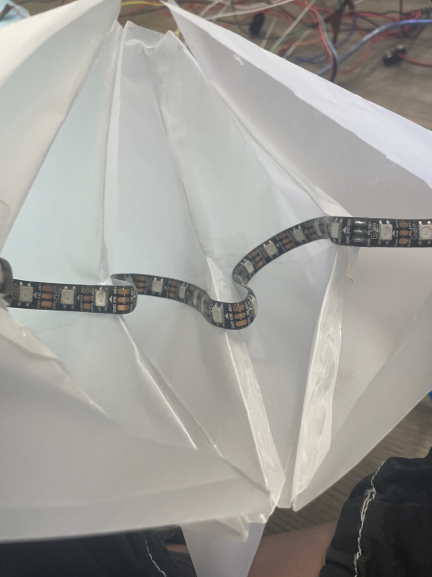

# Sound Reactive Paper Lanterns
Sound-Reactive Paper Lanterns: Transforming a  space with vibrant, sound-reactive paper lanterns controlled by an ESP32 Feather and the WLED software. This project combines Wifi-enabled lighting and LEDfx sound analysis to create a light show responding to music. Look closely to see the aspects of this enticing project!

| **Engineer** | **School** | **Area of Interest** | **Grade** |
|:--:|:--:|:--:|:--:|
| Yuktha A | Dougherty Valley High School | Civil Engineering | Incoming Senior


 | 


  
<!---This is an HTML comment in Markdown -->
<!--- Anything between these symbols will not render on the published site -->

# Modifications
----------------------------


<iframe width="560" height="315" src="https://www.youtube.com/embed/QGX3tDZsAwU?si=x2I9vTJRT5KselOJ&amp;start=35" title="YouTube video player" frameborder="0" allow="accelerometer; autoplay; clipboard-write; encrypted-media; gyroscope; picture-in-picture; web-share" referrerpolicy="strict-origin-when-cross-origin" allowfullscreen></iframe> 


After researching possible modifications for my lanterns, I became interested in incorporating voice commands. I envisioned the lanterns resembling planets, so I decided to enhance the starry night theme by adding LED stars. This led to the creation of my modification: voice-automated LED stars.


By using an Arduino UNO, and the DFRobot Voice Module Device, I can turn on, turn off, and change the LEDs to seven different colors. These LED strips are all stuck on these handmade stars which are wired together using an Arduino. 


### What I Used:


Arduino UNO: The central microcontroller that manages inputs and outputs. 

DFRobot Voice Module: This module captures voice commands and converts them into signals the Arduino can process. 

LED Strips: These are used to create the starry effect. Each LED can be controlled individually to display different colors. 

Handmade Stars: These stars are crafted to house the LED strips using vellum paper, creating a visually appealing effect. 

Wiring: Necessary to connect the LEDs, voice module, and Arduino. 





Figure 1: Inside the Stars


Figure2 : DFROBOT Voice Module

Source: DFROBOT Module Website Documentation


After downloading the Adafruit Neopixel Library as well as the DFRobot Library on the Arduino IDE, I was able to write the appropriate code to program the LED strips.


### Challenges: 
In my modification process, I encountered several challenges related to power distribution and ensuring each component received adequate power. The LEDs required 5V batteries, which meant I couldn't power them with my 9V battery. I also had to troubleshoot the code numerous times on my Arduino UNO. Initially, the code wouldn't flash properly, but after reflashing, disconnecting, and reconnecting, the LEDs lit up again. The day before demo night, my LEDs experienced connection issues, causing the Arduino to stop working. However, after replacing the Arduino and wires, I was able to get the stars to turn on slowly.

### What’s next? 

If I had infinite time, I would like to connect my lanterns and stars to a home assistant. This integration would make the lanterns much easier to control and enhance their functionality.

### Lessons Learned:
I learned many engineering concepts that I wouldn’t have learned in my regular school curriculum. I worked with a lot of electrical engineering concepts like how to Solder, Dremel, and work with wire connections. One of the most significant lessons I learned was the importance of troubleshooting. Facing and solving various challenges taught me the value of persistence and patience. I learned to systematically solve problems, test solutions, and stay resilient despite several setbacks. This experience improved my technical skills and fostered a mindset of perseverance and continuous improvement.


# Final Milestone
----------------------------

<iframe width="560" height="315" src="https://www.youtube.com/embed/RpSbDc5aFOY?si=y1K0bTOWYw7Uj53M" title="YouTube video player" frameborder="0" allow="accelerometer; autoplay; clipboard-write; encrypted-media; gyroscope; picture-in-picture; web-share" referrerpolicy="strict-origin-when-cross-origin" allowfullscreen></iframe>


Figure 3: Flow Chart of Entire Project

--
The third milestone was all about making the lanterns reactive to sound. Apart from WLED software, I used the LEDfx software to run the lanterns. LEDfx software is a program on a computer that analyzes and captures sound and provides real-time audio effects. The difference between LEDfx and WLED is that LEDFx specializes in sound-reactive lighting effects, while WLED is used to enable WiFi-controlled LED strips with home automation integration.

This downloading process took me a long time as several steps existed before installing LEDfx. I needed to have Python 3.9, and dependencies such as Homebrew and pip installed as well. Pip Install is a virtual environment and a command to install packages from package repositories. Packages are software applications that are made up of many files in a grouped format. I ran these applications using command lines on the Terminal. Once I was able to open the app, I connected the appropriate WLED device and changed the audio settings. 

I named my device “Spheres” and was able to customize the effects as it was easier to identify my device. LEDfx app allowed me to explore the different settings and effect types that the lanterns can change into. There were multiple presets and effect configurations as well. I also downloaded the WLED app on my phone to connect to make the user configurations easier.


Figure 4 & 5: LEDFX website
### Challenges:

Despite being the shortest milestone, I encountered the most difficulty during its completion. I struggled with troubleshooting simple software issues, which made installing these applications significantly harder, taking me around two days to install the LEDfx software itself. I overcame these challenges by researching online and meticulously following installation instructions. Another issue I faced was that my lights weren’t properly reacting to sound using the software. After deleting the entire application and restarting my computer multiple times, I successfully resolved this issue, and my lights began working perfectly.

So far, in this project, I learned many key engineering topics. I was exposed to the electrical aspect, mechanical, and software as well. There were several times when I didn’t know the topic and the concept behind what I was doing. Through a lot of research, I learned that I have to explore around and try everything to see what I like. I have about 3 weeks left here at BSE, so I hope to add my modifications to this project. With the time I have, I want to attempt to make my project more personal to me.


# Second Milestone

<iframe width="560" height="315" src="https://www.youtube.com/embed/uiyLtA5mo70?si=u4MuuchZxNU_SF7s" title="YouTube video player" frameborder="0" allow="accelerometer; autoplay; clipboard-write; encrypted-media; gyroscope; picture-in-picture; web-share" referrerpolicy="strict-origin-when-cross-origin" allowfullscreen></iframe>

--------------------------------------------------------

### Milestone 2: Building and Wiring the Lanterns 

In this milestone, I assembled and wired the five paper lanterns to make them light up. This milestone was very mechanical and electrical-focused. Each lantern contains a NeoPixel Ring and is connected in a daisy chain configuration. All the nodes/wires are connected to the next in a line or chain in a sequence. 


Figure 6: Picture of Final Display

To start, I assembled the single power rail for all five lanterns. To begin, I found the striped wire in the ribbon cable to use as the power wire (+5V). I separated the fourth wire from the cable since I only needed three wires (power, ground, and data). The middle wire was the data wire, with the third outer wire being the ground. (See figure below). I needed to connect the power rail to the JST connector so the lanterns have a power source. I attached the red/USB wire from the JST connector to the striped power wire on the power rail, which will carry the +5V power. Then, I connected the middle/data wire to the middle wire on the power rail. The data wire connects to the middle wire, transmitting data signals from the Feather to control the LEDs in each lantern. Finally, I attached the ground wire (G) to the edge wire on the power rail, which will complete the circuit. 

After ensuring the power rail had a power source using a multimeter, I arranged my lanterns. Stretching the power rail out, I roughly arranged my lanterns below it. I created a random layout for a more aesthetic appeal. To mark the lanterns’ position, I pulled three wires on the power rail apart by about an inch.

### Connecting the Lanterns:

Since the lantern ring had a “data in” and “data out” wire, I cut the power rail’s middle data wire, making the side that was closer to power the “data IN” and the further side to be the “data OUT”. Exposing the power and ground wires made my connection process a lot easier. To connect the power and ground wires, I twisted the striped wire from the lantern ring around the exposed section of the striped power wire on the power rail. For the data wires, I twisted the “data IN” wires and the “data OUT” wires to their corresponding wires on the power rail. I went ahead and soldered all the points together. I did the same process with all five lanterns. To ensure that  there was power in all the lanterns, I double-checked all the connections with a multimeter.
Below is the wiring diagram of the lanterns:


Figure 7 and 8: Wiring Diagram


### Challenges:

When I first attached all the lanterns on the power rail and plugged everything in, only one light was lighting up. I thought it was an electrical issue, so I wrapped electrical tape on every single solder point to make sure there was nothing was incorrectly connected. I checked for continuity multiple times as well. The remaining four lanterns still haven’t lit up though, so I did some research on the WLED website. After countless amount of times not being able to get the lights to light up, I tried looking at the configuration settings on the WLED website. The length was set to lighting only 12 pixels instead of all 60 throughout all five rings. After I changed the setting, the lights all lit up successfully. 

My next milestone is about making the lanterns sound reactive! I am excited to see the end product.


# First Milestone

<iframe width="560" height="315" src="https://www.youtube.com/embed/rk84H7lvbns?si=rWQlfoO3zJcTjpi2" title="YouTube video player" frameborder="0" allow="accelerometer; autoplay; clipboard-write; encrypted-media; gyroscope; picture-in-picture; web-share" referrerpolicy="strict-origin-when-cross-origin" allowfullscreen></iframe> 
---------------------------
For my first milestone, I focused on the electrical aspects of my project.

To start, I set up the WLED (white light emitting diode) software on my feather microcontroller. The WLED software is an open-source software, a software that allows for one to inspect, modify, and enhance the source code. Through WLED, I control LEDs with a web server or phone app. I needed to download the software and connect it to the proper 4G wifi connection. On the software, there were different settings that I needed to customize in order to fit the requirements for my lanterns. For example, in the preferences, I had five rings with 12 pixels each, so that would be 60 pixels total.

After starting the setup on the software, I moved on to assembling the electric components
The components I used for this:

Adafruit ESP32 Feather V2 - 8MB Flash + 2 MB PSRAM: 
ESP32 is a chip that provides Wi-Fi and Bluetooth connectivity for embedded devices
PSRAM (Psuedostatic RAM) memory.
JST 2-pin Extension Cable with On/Off Switch - JST PH2 : JST (Japanese Solderless Terminal) are electrical connectors. In this extension cable, one end has a classic female JST-PH2 socket, and the other end has a matching plug.
Female DC Power adapter
5V 2A (2000mA) switching power supply


Figure 9: Feather ESP V2 Schematic

To begin, I cut the female JST connector and screwed it into the Female DC power adapter, which had a 2.1mm DC jack on one end and a screw terminal block on the other. The red wire is screwed into positive, representing the power. On the other hand, the black wire is screwed into the negative part of the screw terminal, representing ground. This red-to-power and black-to-ground is the standard convention.

Next, I soldered the data wire, the middle wire on my 3-pin JST connector, onto pin 12 on my Feather. To feed power into the Feather and my lights, I then soldered my leftmost red wire with the female and male JST connector that was already connected to the Feather. I did the same thing with my rightmost black wires with the corresponding black wires on the JST connector. It was important to stay consistent with which wire I was using. To avoid confusion, I used electrical tape and color-coded all my wires. 


Figure 10,11: JST Connector Diagram

### Stand Wiring:

Next, I moved on to creating my lights. I used 5 NeoPixel Ring - 5050 RGB LED with Integrated Drivers. To hang the lights up, I used a 4-wire 26awg Silicone-Coated Ribbon Cable. I used different lengths of cable for each Neo Ring to make each lantern hang at a different length in the future. To attach the cable to the ring, I soldered each to a piece of ribbon cable. Each ring had a particular order that had to be soldered on. 
Striped wire: 5V(Power)  2nd wire: data OUT 3rd wire: data IN 4th wire: Ground. 


Figure 12: Stand Wiring

### Challenges:
When I first started my project, I wasn’t able to download the software on the Feather. After using a different device, got the software onto the feather. The software only works on a network less than 5G, so I had trouble connecting all the devices. I overcame this issue by connecting to a peer’s hotspot and using their downloaded software on a non-apple product to connect. 

Another challenge I faced was connecting the wires. I had difficulty in twisting, soldering, and heat-shrinking multiple wires together. I overcame this issue by stripping more wire and adding a bigger size of heat shrink on the set of wires. 

### Next Steps:

The next milestone includes of assembling all the lanterns and attaching them to a power rail. I am excited to see how I progress through this project. 


### CODE:

MODIFICATION CODE:

```ruby
/*!
 * @file  i2c.ino
 * @brief Control the voice recognition module via I2C
 * @n  Get the recognized command ID and play the corresponding reply audio according to the ID;
 * @n  Get and set the wake-up state duration
 * @copyright  Copyright (c) 2010 DFRobot Co.Ltd (http://www.dfrobot.com)
 * @licence  The MIT License (MIT)
 * @author  [qsjhyy](yihuan.huang@dfrobot.com)
 * @version  V1.0
 * @date  2022-04-02
 * @url  https://github.com/DFRobot/DFRobot_DF2301Q
 */
#include "DFRobot_DF2301Q.h"
#include <Adafruit_NeoPixel.h>

#define STRIP1PIN 6
// #define STRIP2PIN 7
// #define STRIP3PIN 8
// #define STRIP4PIN 9
#define BRIGHTNESS 50 
Adafruit_NeoPixel strip1 = Adafruit_NeoPixel(72, STRIP1PIN, NEO_GRB + NEO_KHZ800);
// Adafruit_NeoPixel strip2= Adafruit_NeoPixel(30, STRIP2PIN, NEO_GRB + NEO_KHZ800);
// Adafruit_NeoPixel strip3 = Adafruit_NeoPixel(30, STRIP3PIN, NEO_GRB + NEO_KHZ800);
// Adafruit_NeoPixel strip4 = Adafruit_NeoPixel(61, STRIP4PIN, NEO_GRB + NEO_KHZ800);

//I2C communication
DFRobot_DF2301Q_I2C asr;

void setup() {
  #if defined(__AVR_ATtiny85__) && (F_CPU == 16000000)
  clock_prescale_set(clock_div_1);
  #endif
  // END of Trinket-specific code.

  strip1.begin();           // INITIALIZE NeoPixel strip object (REQUIRED)
  strip1.show();            // Turn OFF all pixels ASAP
  strip1.setBrightness(BRIGHTNESS);

  Serial.begin(115200);

  // pinMode(Led, OUTPUT);    //Init LED pin to output mode
  // digitalWrite(Led, LOW);  //Set LED pin to low 

  // Init the sensor
  while (!(asr.begin())) {
    Serial.println("Communication with device failed, please check connection");
    delay(3000);
  }
  Serial.println("Begin ok!");

  /**
   * @brief Set voice volume
   * @param voc - Volume value(1~7)
   */
  asr.setVolume(4);

  /**
     @brief Set mute mode
     @param mode - Mute mode; set value 1: mute, 0: unmute
  */
  asr.setMuteMode(0);

  /**
     @brief Set wake-up duration
     @param wakeTime - Wake-up duration (0-255)
  */
  asr.setWakeTime(20);

  /**
     @brief Get wake-up duration
     @return The currently-set wake-up period
  */
  uint8_t wakeTime = 0;
  wakeTime = asr.getWakeTime();
  Serial.print("wakeTime = ");
  Serial.println(wakeTime);

  // asr.playByCMDID(1);   // Wake-up command

  /**
     @brief Play the corresponding reply audio according to the ID
     @param CMDID - command word ID
  */
  //asr.playByCMDID(23);  // Command word ID
}

void loop() {
  /**
     @brief Get the ID corresponding to the command word 
     @return Return the obtained command word ID, returning 0 means no valid ID is obtained
  */
  uint8_t CMDID = asr.getCMDID();
  switch (CMDID) {
    case 103:                                                  //If the command is “Turn on the light”
      Serial.println("received'Turn on the light',command flag'103'");  //Serial transmits "received"Turn on the light",command flag"103
      colorWipe(strip1.Color(255,   0,   0)     , 50); // Red
      colorWipe(strip1.Color(  0, 255,   0)     , 50); // Green
      colorWipe(strip1.Color(  0,   0, 255)     , 50); // Blue
      colorWipe(strip1.Color(  0,   0,   0, 255), 50); // True white (not RGB white)

      whiteOverRainbow(75, 5);

      pulseWhite(5);

      rainbowFade2White(3, 3, 1);

      break;

    case 104:                                                  //If the command is “Turn off the light”
      Serial.println("received'Turn off the light', command flag '104' ");  //The serial transmits "received"Turn off the light",command flag"104""
      strip1.clear(); 
      // strip2.clear(); 
      // strip3.clear(); 
      // strip4.clear(); 
      break;

    // case 119:
    //   Serial.println("received'Set to green',command flag'119'"); //The serial transmits "received"Set to green",command flag"119""
    //   for (int i=0; i<72;i++){
    //     strip1.setPixelColor(i, 0, 255, 0); //code that sets all the led pixels to red
    //   }
    //   for (int i=0; i<30;i++){
    //     strip2.setPixelColor(i, 0, 255, 0); //code that sets all the led pixels to red
    //   }
    //   for (int i=0; i<30;i++){
    //     strip3.setPixelColor(i, 0, 255, 0); //code that sets all the led pixels to red
    //   }
    //   for (int i=0; i<61;i++){
    //     strip4.setPixelColor(i, 0, 255, 0); //code that sets all the led pixels to red
    //   }
      strip1.show();
      // strip2.show();
      // strip3.show();
      // strip4.show();
      delay(400);
      break;

    default:
      if (CMDID != 0) {
        Serial.print("CMDID = ");  //Printing command ID
        Serial.println(CMDID);
      }
      
  }

  
    
  delay(300);

}


void colorWipe(uint32_t color, int wait) {
  for(int i=0; i<strip1.numPixels(); i++) { // For each pixel in strip1...
    strip1.setPixelColor(i, color);         //  Set pixel's color (in RAM)
    strip1.show();                          //  Update strip to match
    delay(wait);                           //  Pause for a moment
  }
}

void whiteOverRainbow(int whiteSpeed, int whiteLength) {

  if(whiteLength >= strip1.numPixels()) whiteLength = strip1.numPixels() - 1;

  int      head          = whiteLength - 1;
  int      tail          = 0;
  int      loops         = 3;
  int      loopNum       = 0;
  uint32_t lastTime      = millis();
  uint32_t firstPixelHue = 0;

  for(;;) { // Repeat forever (or until a 'break' or 'return')
    for(int i=0; i<strip1.numPixels(); i++) {  // For each pixel in strip1...
      if(((i >= tail) && (i <= head)) ||      //  If between head & tail...
         ((tail > head) && ((i >= tail) || (i <= head)))) {
        strip1.setPixelColor(i, strip1.Color(0, 0, 0, 255)); // Set white
      } else {                                             // else set rainbow
        int pixelHue = firstPixelHue + (i * 65536L / strip1.numPixels());
        strip1.setPixelColor(i, strip1.gamma32(strip1.ColorHSV(pixelHue)));
      }
    }

    strip1.show(); // Update strip with new contents
    // There's no delay here, it just runs full-tilt until the timer and
    // counter combination below runs out.

    firstPixelHue += 40; // Advance just a little along the color wheel

    if((millis() - lastTime) > whiteSpeed) { // Time to update head/tail?
      if(++head >= strip1.numPixels()) {      // Advance head, wrap around
        head = 0;
        if(++loopNum >= loops) return;
      }
      if(++tail >= strip1.numPixels()) {      // Advance tail, wrap around
        tail = 0;
      }
      lastTime = millis();                   // Save time of last movement
    }
  }
}

void pulseWhite(uint8_t wait) {
  for(int j=0; j<256; j++) { // Ramp up from 0 to 255
    // Fill entire strip with white at gamma-corrected brightness level 'j':
    strip1.fill(strip1.Color(0, 0, 0, strip1.gamma8(j)));
    strip1.show();
    delay(wait);
  }

  for(int j=255; j>=0; j--) { // Ramp down from 255 to 0
    strip1.fill(strip1.Color(0, 0, 0, strip1.gamma8(j)));
    strip1.show();
    delay(wait);
  }
}

void rainbowFade2White(int wait, int rainbowLoops, int whiteLoops) {
  int fadeVal=0, fadeMax=100;

  // Hue of first pixel runs 'rainbowLoops' complete loops through the color
  // wheel. Color wheel has a range of 65536 but it's OK if we roll over, so
  // just count from 0 to rainbowLoops*65536, using steps of 256 so we
  // advance around the wheel at a decent clip.
  for(uint32_t firstPixelHue = 0; firstPixelHue < rainbowLoops*65536;
    firstPixelHue += 256) {

    for(int i=0; i<strip1.numPixels(); i++) { // For each pixel in strip1...

      // Offset pixel hue by an amount to make one full revolution of the
      // color wheel (range of 65536) along the length of the strip
      // (strip1.numPixels() steps):
      uint32_t pixelHue = firstPixelHue + (i * 65536L / strip1.numPixels());

      // strip1.ColorHSV() can take 1 or 3 arguments: a hue (0 to 65535) or
      // optionally add saturation and value (brightness) (each 0 to 255).
      // Here we're using just the three-argument variant, though the
      // second value (saturation) is a constant 255.
      strip1.setPixelColor(i, strip1.gamma32(strip1.ColorHSV(pixelHue, 255,
        255 * fadeVal / fadeMax)));
    }

    strip1.show();
    delay(wait);

    if(firstPixelHue < 65536) {                              // First loop,
      if(fadeVal < fadeMax) fadeVal++;                       // fade in
    } else if(firstPixelHue >= ((rainbowLoops-1) * 65536)) { // Last loop,
      if(fadeVal > 0) fadeVal--;                             // fade out
    } else {
      fadeVal = fadeMax; // Interim loop, make sure fade is at max
    }
  }

  for(int k=0; k<whiteLoops; k++) {
    for(int j=0; j<256; j++) { // Ramp up 0 to 255
      // Fill entire strip with white at gamma-corrected brightness level 'j':
      strip1.fill(strip1.Color(0, 0, 0, strip1.gamma8(j)));
      strip1.show();
    }
    delay(1000); // Pause 1 second
    for(int j=255; j>=0; j--) { // Ramp down 255 to 0
      strip1.fill(strip1.Color(0, 0, 0, strip1.gamma8(j)));
      strip1.show();
    }
  }

  delay(500); // Pause 1/2 second
}
```

This code integrates the Adafruit Neopixel Library and the DFRobot Voice Module Library to control LED strips via voice commands using an Arduino. It initializes the LED strips and voice module, listens for specific voice commands, and executes corresponding LED patterns such as turning the LEDs on, and off and changing colors. The code includes several functions to create various LED effects, like color wipes and rainbow fades.


# Bill of Materials

| **Part** | **Note** | **Price** | **Link** |
|:--:|:--:|:--:|:--:|
| Adafruit ESP32 Feather V2 - 8MB Flash + 2 MB PSRAM |Microcontroller/ Audio Processing/ Control of LEDs| $19.95 | <a href="https://www.adafruit.com/product/5400"> Link </a> |
| NeoPixel Ring - 5 x 5050 RGB LED with Integrated Drivers | Sound-Reactive Lighting Effects | $7.50 | <a href="https://www.adafruit.com/product/1643"> Link </a> |
| Paper Lanterns| Housing for LEDs/ Decorative Element | $17.99 | <a href="https://www.amazon.com/dp/B0757KS4L8?_encoding=UTF8&psc=1&ref_=cm_sw_r_cp_ud_dp_JMMSSZR94M6K803XZNP4"> Link </a> |
|4-wire 26awg Silicone Coated Ribbon Cable |Power and Signal Transmission | $19.98 | <a href="https://www.amazon.com/dp/B07PMS4WNN?_encoding=UTF8&psc=1&ref_=cm_sw_r_cp_ud_dp_6S4PN0M8W63V88Q4RCYG_1"> Link </a> |
| JST Connector x 1 | Wire Connections| $1.50 | <a href="https://www.adafruit.com/product/1663"> Link </a> |
| Female DC Power Adapter | Voltage and Current Power Connection | $2.00 | <a href="https://www.adafruit.com/product/368"> Link </a> |
| 5v 2A Power Supply| Powering Componenet | $7.95 | <a href="https://www.adafruit.com/product/276"> Link </a> |
| JST 2-pin Extension Cable with On/Off Switch | Power Control| $2.95 | <a href="https://www.adafruit.com/product/3064"> Link </a> |

# Resources/ Works Cited

Project Guide:<a href="https://www.adafruit.com/product/1643](https://learn.adafruit.com/sound-reactive-paper-lanterns-with-led-fx"> Link </a>

DFRobot Voice Module:<a href="https://wiki.dfrobot.com/SKU_SEN0539-EN_Gravity_Voice_Recognition_Module_I2C_UART#target_9
"> Link </a>

LEDFx Instructions: <a href="https://ledfx.readthedocs.io/en/latest/"> Link </a>

RGB LED Light Strips Documentation: <a href="https://learn.adafruit.com/rgb-led-strips/usage
"> Link </a>


<!---# Other Resources/Examples
One of the best parts about Github is that you can view how other people set up their own work. Here are some past BSE portfolios that are awesome examples. You can view how they set up their portfolio, and you can view their index.md files to understand how they implemented different portfolio components.
- [Example 1](https://trashytuber.github.io/YimingJiaBlueStamp/)
- [Example 2](https://sviatil0.github.io/Sviatoslav_BSE/)
- [Example 3](https://arneshkumar.github.io/arneshbluestamp/)

-->
# STARTER PROJECT:


As a starter project, I chose to build the Retro Arcade Game Console. I chose this project because I love gaming in my free time. The games included in the kit are Tetris, snakes, race cars, space invaders, and slot machines. There are several components in this console, and they’re listed in the section: Components Used. A vital piece is the microcontroller as it drives the other functions. The main concept of this project is the microcontroller can detect when a key is pressed and decide accordingly.

The games are displayed on the LED (Light Emitting Diode) DOT MATRIX module. Data is sent to the module through control signals from the microcontroller, defining which LEDs should be on or off. More details in the section below.

Below is a picture of the labeled features on the starter project:


Figure 13: Button Functions


Figure 14: Schematic Diagram
Components Used:
12mm Buzzer
Electric Capacitator
Self-switch
IC (Integrated Circuit) Chip 
Digitron Display/ 7-segment display: The score is displayed on a 7-segment display that works by illuminating specific segments out of seven to form numbers or characters.

LED dot matrix module: An LED dot matrix module creates patterns or characters by rapidly scanning rows or columns of LEDs and controlling which are lit through multiplexing and control circuitry.  

Button Schematic Diagram:


Figure 15: Button Schematic
In this console, a button works by closing an electrical circuit and sending a signal to the microcontroller. The microcontroller will detect the signal, process it through its preset instructions, and then trigger the corresponding action in the game. Once triggered, the microcontroller will update the LED dot matrix module to make the following changes. The microcontroller controls the rows and columns of the LED matrix using multiplexing, ensuring that the right visual display is on the module.
-->
### Challenges:

Despite the project seeming smooth, there were quite a lot of difficulties I faced along the way. As I was attaching the outer acrylic frame, the side piece cracked, blocking my way of connecting the USB port to power the console. Another challenge I faced was regarding the buzzer. My 12 mm buzzer was originally soldered in the wrong direction. When trying to desolder it, the wires snapped and got stuck in the PCB. After an hour of trying different methods to remove the wire, I ended up having to start over my entire project. A lesson I learned is that sometimes you have to restart, but you will be more efficient and effective the second time around. I’m excited to start my main project: Sound Reactive Paper Lanterns. 
